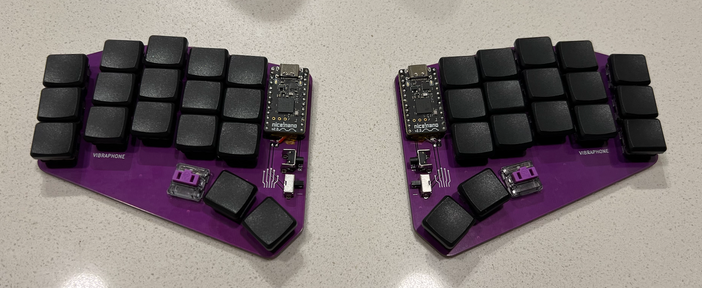
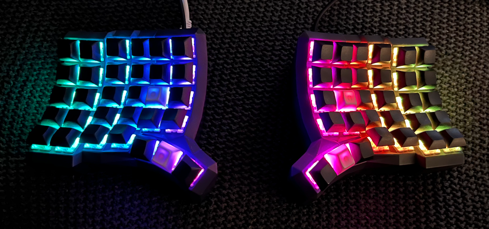

# Gkey - Gerry's Custom Keyboards

I've decided to start developing all of my keyboards in a single repo that
has a simplified directory structure and is easy to use.

This repo is really just for my own noodling, so I haven't taken the time to
document much. But if you have any questions whatsoever, please do reach out
and ask!

## Keyboards

### Vibraphone

It's called Vibraphone because:
- I'm a percussionist. 🥁
- A vibraphone is a *keyboard instrument*.
- It has fewer keys than a xylophone.
- It is flat, unlike a xylophone.

The Vibraphone is my daily driver keyboard and also acts as my core, reference
keymap. It runs on ZMK firmware and is a no-nonsense, serious keyboard,
heavily customized for my keyboard-centric workflow. All of my other keyboards
use the Vibraphone keymap as their base layer.

The PCB was designed by [Cyboard](https://www.cyboard.digital/) based on scans
of my hands and several iterations of printed mockups. The PCB features zero
diodes and hard-soldered keys for maximum durability. It can be thrown into a
bag without a case without any worry. The reset buttons and power toggle
switches are guarded by the PCB to reduce accidintal operation, too.

One neat thing about this design is the non-uniform spacing. This is to minimize
movement effort without cramping fingers too close to each other. Horizontally,
keys are spaced apart to separate each finger, other than the index finger
clusters. Otherwise, the keys are as close to each other as possible. The net
effect is that I can type without moving my hands; only my digits move.

The combination of PCB layout and keymap completely eliminates tucking a thumb
under my palm while typing. That is a painful movement for me, so eliminating
it was a design goal.

The Vibraphone keymap is actually for 34 keys. The two extra thumb keys are
intentionally out of the way and are only used for gaming layers. That said,
gaming is a non-goal with the Vibraphone.

The Vibraphone is actually based on another custom keyboard I no longer use: the
Marimba. It's almost identical, except the Marima was a bit larger and non-flat.

#### Goals
- Purple: the best color
- Minimal, low effort movement
- Portable
- Durable: designed for rough wear and tear
- Fits on top of a laptop keyboard
- Wireless (Bluetooth)
- Support multiple devices concurrently (up to 5)
- Optional support for wired interface over USB-C
- No thumb tucking while typing normally

### Xylophone

It's called a Xylophone because:
- I want to continue my percussion theme. 🥁
- A xylophone is a *keyboard instrument*. Get it?!
- It has more keys than a vibraphone.
- It is *not* flat, unlike a vibraphone.

This is something else. In essence, it's a mostly standard
[Cyboard Dactyl Manuform](https://www.cyboard.digital/product-page/Dactyl-Manuform),
except I customized the position and angle of the thumb arch to be a closer
analog to the Vibraphone. But, as can be seen in the photo, this is the
opposite of no-nonsense. This is for fun!

It runs on QMK firmware on the
[RP2040 Microcontroller](https://www.raspberrypi.com/products/rp2040/). It is
a dual core beast of an MCU and I do have some ideas for taking advantage of
it.

This keyboard's keymap is in a "first draft" state and isn't quite ready for
typing, but the gaming use case is fine. The remaining development items needed
for parity with the Vibraphone keymap are:
- Get combos to work (currently all broken)
- Tweak multi-function key movements (hold-vs-tap strategies, etc)

Use cases for the Xylophone:
- Gaming
- RGB effects
- Learning embedded firmware development things I'd like to tinker with

#### Goals
- Gaming: Optional zero-latency key resolution
- Gaming: More buttons reachable from home position without a layer change
- Experimenting with "bowled" keyboard shape
